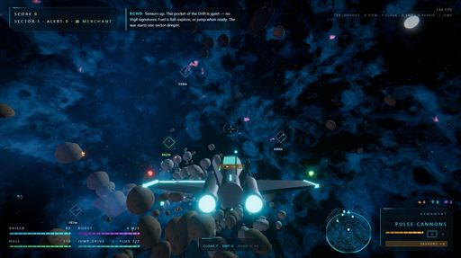
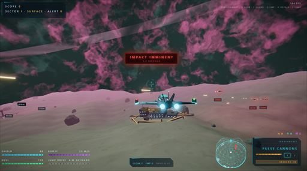
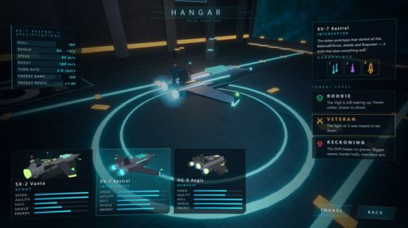

# Nebula Reckoning

Last updated: 2026-08-01.

[MIT License](LICENSE) · [Contributing](CONTRIBUTING.md) ·
[Security](SECURITY.md) · [Play the latest production build](https://victorzakharov.github.io/NebReck/)

> **Development note:** This project was vibe-coded over just two real-time days
> using a combination of Fable 5 High and GPT-5.6 Sol Max.

A fast arcade space dogfighter in the spirit of Everspace, built from scratch with
**three.js + TypeScript + webpack**. Original fiction: you are Wren Callis, flying
prototype hulls against the Vigil — an ancient machine fleet "preserving" the Halcyon
Drift by emptying it.

Everything is procedural: ships, cockpit, nebula skyboxes, planets, asteroid fields,
particle FX, and even the audio (WebAudio synthesis — zero binary assets in the repo).

## Screenshots

<table width="100%">
  <tr>
    <td width="33.333%">
      <a href="screenshots/nebreck_1.jpg"></a>
    </td>
    <td width="33.333%">
      <a href="screenshots/nebreck_2.jpg"></a>
    </td>
    <td width="33.333%">
      <a href="screenshots/nebreck_3.jpg"></a>
    </td>
  </tr>
</table>

## The loop

Launch into a **peaceful first sector** with full jump fuel — mine ore veins, crack
cave asteroids and wreck blackboxes, hail haulers (R) for **procedural contracts**
(bounties, procurement, beacon deliveries, cross-sector courier runs) — then spool
the jump drive (J, 2 Flux Cores) into ever-meaner sectors. Vigil kills raise your
**alert**; hunter wings come collecting. Death banks your score as **credits** for
permanent Legacy upgrades. The capital ship suppresses your jump drive, carries
twelve individually destructible batteries, and threatens the frontal approach
with a telegraphed annihilator beam — cripple it, destroy it, or outrun its field.

## Features

- **Three playable ships** (Kestrel interceptor / Vanta scout / Aegis gunship) chosen
  in an interactive convex-visor hangar, plus three difficulty tiers with real
  multipliers. Explicit card clicks commit ship and difficulty to one-year,
  root-scoped browser cookies, so choices survive reloads without requiring Engage
  or game entry; opening or rendering the hangar never rewrites them.
- **Phone and tablet controls**: an adaptive portrait/landscape flight deck supplies
  analog move/aim sticks plus 17 non-overlapping touch targets for maneuvering,
  weapons, devices, interactions, view, Engineering, and pause. Touch devices use
  a compact native-DOM hangar so every ship, threat, Engage, and Back choice remains
  directly tappable and vertical swipes may begin anywhere on the hangar UI,
  including the selected ship/hardpoint panel; desktop keeps the shared curved visor.
- **Combat**: four primary weapon profiles + lock-on seeker missiles, cover-independent
  soft-targeting with lead pip, enemy AI wings (raiders, rotary interceptors, wardens
  and missile bombers), mixed cannon / rotary / homing-rocket / fast-rocket batteries,
  escalating waves and story comms. Seeker bombers can launch while pursuing from
  1,200 m; player seekers expire after 1,050 m of actual traveled path. Live missiles
  raise lock and monotonic two-second impact warnings, while a safely activated cloak
  breaks their tracking. With no enemy pursuing, hostile and
  civilian contacts at every range share one uncapped, camera-origin crosshair ranking
  inside a tight target-sized sensor cone;
  active pursuit restores hostile priority and distance-weighted close-combat aim assist. Civilians
  remain sensor-only and never autoaim. Hostile previews retain green→red health
  wireframes inside a separate red silhouette-perimeter glow (internal edges are
  never relationship-tinted); civilians use relationship colors and
  mineable veins use their resource color.
  Sensor selection works through asteroids and terrain; physical fire and enemy
  attacks remain line-of-sight blocked.
- **Arrival awareness**: sector jumps and planetary lift-off face the ship toward
  the equal-weight majority bearing of visible contacts, without letting a carrier's
  twelve batteries outweigh the carrier itself. The Aegis launches with 16 seekers
  and fabricates one more every 10 seconds in flight; the Kestrel starts with 8 and
  does not regenerate them.
- **Mining & crafting**: shoot glowing ore veins on asteroids, tractor in salvage
  (Scrap / Ion Crystals / Flux Cores), spend it mid-run in the Tab Engineering screen
  on repairs, refills and three-rank per-run upgrades. A shared original SVG set
  identifies every material/consumable in the HUD, hold and cost chips. Vein hints
  and informational resource-colored vein wireframes follow a stable, smoothly projected centroid;
  merchant, stash and landing prompts follow their world objects too. Crafting keeps
  its scroll position, is safety-locked within 180 m of a hostile, and cannot produce
  or buy missiles for a hull without a rack. The jump HUD shows required/held Flux.
- **Planet dungeons**: broad, open-bottomed rock arches over carved cave routes,
  connected angular bases, patrols, turrets, stashes and crystals. Visible cave
  rock and its overlapping outward collision shell share one profile, while ground
  collision interpolates the exact rendered terrain triangles. Cave paths cannot
  fold through themselves, entrances stay clear, rock formations use bounded
  lobes instead of needle spires, impact damage scales with closing speed, and every
  surface turret mount is collider-cleared so the battery remains exposed to fire.
  Revisiting the same planet in a sortie restores the exact terrain, harvested
  loot, surviving enemies and cleared garrison state.
- **Two cameras**: banked chase cam and a first-person cockpit with glowing MFDs,
  blended smoothly (V), plus damage-scaled positional and rotational impact shake.
- **Visuals**: fragment-correct solar corona, HDR bloom, ACES tonemap, SMAA,
  chromatic aberration on boost, procedural nebula/planets/asteroids, one-sided
  shield-hit ripples, and pooled preset explosions with instanced 3D fireball
  volumes, spherical shock fronts, lights, and large fly-through smoke clouds for
  missiles and destroyed ships. Energy bolts remain smoke-free. Projectile FX begin
  on the actual transformed asteroid surface; shattered asteroids become persistent,
  destructible child rocks that coast and tumble outward, while ships and turrets
  throw bounded pieces of their own modeled parts rather than VFX rods.
  Those parts drift in space and fall, bounce, and settle against planetary terrain.
- **Adaptive high-refresh rendering**: the rAF-driven simulation stays frame-rate
  independent while a hysteresis-controlled framebuffer targets smooth play without
  changing the native-resolution DOM HUD. Native and Retina-style 4K both begin at
  a 1080p internal pixel budget, can descend toward 720p after sustained overload,
  and recover quality gradually when headroom returns. Static hull/cave primitives,
  planet structures, and volumetric fog billboards are GPU-batched. Planet collision,
  line-of-sight, and projectile sweeps use a spatial index over the exact authored
  bodies, while cave illumination reuses two camera-local lights instead of adding
  every cave light to every material shader. The deterministic benchmarks preserve
  scene detail while enforcing 330 hostile-space and 90 dense-planet draw-call caps.

## Run

Node.js 24 is the supported runtime (`.nvmrc` pins the project major).

```bash
npm install
npm run dev        # http://localhost:8080
npm run build      # production bundle → dist/
```

For the interactive hangar review route used during development:

```text
http://127.0.0.1:8123/?testScene=hangar-live&seed=7
```

## Deployments

Every merge to `main` publishes the production bundle to
[GitHub Pages](https://victorzakharov.github.io/NebReck/). Pull requests
opened from branches in this repository receive an isolated preview at
`/pr-preview/pr-<number>/`; the workflow posts that link on the PR and removes
the preview when the PR closes. Fork pull requests run read-only CI without
deployment credentials.

## Controls

| Input | Action |
|---|---|
| Mouse | Steer (pitch/yaw) |
| LMB / RMB | Primary fire / seeker missile |
| W / S | Thrust / brake |
| A / D, Space / L-Ctrl | Strafe; L-Ctrl + W descends while thrusting forward |
| Q / E | Roll |
| Shift | Boost |
| 1·2·3 / wheel | Switch weapon |
| V | Toggle cockpit / chase camera |
| Tab | Engineering (craft & repair) |
| J (hold) | Spool jump / land / lift off |
| R | Hail, trade, deliver or accept |
| F / G / H | Cloak / EMP / nanobots |
| Esc | Pause |
| F11 / Fullscreen button | Toggle fullscreen |
| Touch | Adaptive portrait/landscape dual move/aim sticks + dedicated flight, combat, system, interaction, view, loadout, and pause controls |

Engage captures the desktop pointer but never changes fullscreen state. Use the
**Toggle Fullscreen** control on the title or pause screen when you want app
fullscreen; F11 remains the browser-level toggle. App fullscreen uses Keyboard
Lock where supported so modifier movement chords such as `L-Ctrl + W` remain game
input instead of browser shortcuts. If a browser rejects the first pointer-lock
request, click the game canvas once to recapture the mouse; that click is consumed
and does not fire.
Coarse-pointer devices automatically use the touch flight deck and skip pointer lock.

The in-game **Field Manual** (main menu) documents every implemented mechanic.

## Testing

```bash
npm run test:architecture     # enforce controller and harness line-size budgets
npm run typecheck            # strict TS, no emit
npm run test:performance     # repeatable 1080p / native-4K / Retina-4K renderer report
npm run test:visual          # full local/release sweep of 43 ignored baselines
npm run test:visual:update   # re-capture local baselines after intentional changes
npm run test:smoke           # end-to-end behavior + persistence regression suite
```

The smoke command keeps a thin runner in `test/smoke.mjs`; focused hangar, world,
targeting, capital, runtime, and real coarse-pointer mobile probes live under `test/smoke/` and share
deterministic artificial-time helpers.

The performance command stages both a real hostile sector and a dense planetary
base in the production build. It reports framebuffer size, draw calls, triangles,
GPU-synchronized frame time, simulation-only time, and render-only time for three
display profiles. Timing is diagnostic rather than a machine-specific threshold;
deterministic 330-call space and 90-call planet budgets plus smoke tests guard
batching, local-light limits, collision indexing, and adaptive resolution. Pass
`-- --world=planet` or `-- --profile=1080p` for a focused iteration run.

The visual harness (`test/visual/run.mjs`) builds the app, serves `dist/`, drives
headless Chromium on SwiftShader (software GL → GPU-independent pixels), loads each
scene via `/?testScene=<name>&seed=7`, and diffs screenshots with pixelmatch.
Scenes are staged deterministically (seeded RNG, fixed-step simulation, frozen CSS
animations) — a same-machine re-render diffs at exactly 0.000%. Baselines are local
generated artifacts and are intentionally not committed: the first run creates
them, and subsequent runs compare against them. The 43 scenes cover world art,
every major screen, targeting, combat/FX, caves, bases, trade, fleet connectivity,
cloak, desktop controls, phone controls/hangar/overlays, volumetric destruction,
enemy variants, missile warnings, and the capital superweapon.
Failure diffs land in `test/visual/diff/`.
Use `-- --scene=<name>` during normal PR iteration; the full software-WebGL
sweep is intentionally local/release-only and is not duplicated in CI.

## Documentation

- [docs/SYSTEMS.md](docs/SYSTEMS.md) — the gameplay rulebook: every mechanic with
  its actual numbers (travel, alert, contracts, economy, devices, meta, planets).
- [docs/ARCHITECTURE.md](docs/ARCHITECTURE.md) — module map, state machine, frame
  flow, space↔planet environment duality, rendering pipeline, event catalog.
- [docs/GOTCHAS.md](docs/GOTCHAS.md) — hard-won pitfalls with root causes
  (lookAt/+Z, light-count recompiles, rng fork order, clip-path label clipping,
  pointer-lock quirks, …). **Read before touching world gen, cameras, or AI.**
- [docs/EXTENDING.md](docs/EXTENDING.md) — per-feature recipes: weapon, enemy,
  ship, quest kind, device, trade, base template, marker kind, and tuning knobs.
- [docs/TESTING.md](docs/TESTING.md) — harness contract, per-scene coverage,
  staging rules, smoke assertions.
- [CLAUDE.md](CLAUDE.md) — condensed agent onboarding + non-negotiable rules.

## Contributing

Issues and pull requests are welcome. Start with
[CONTRIBUTING.md](CONTRIBUTING.md), which documents setup, required checks, and
the project's deterministic rendering rules. Please report security issues
privately as described in [SECURITY.md](SECURITY.md).

## License

Copyright © 2026 Victor Zakharov.

Nebula Reckoning is released under the [MIT License](LICENSE). Production
bundles include the license and the notices for incorporated dependencies in
[THIRD_PARTY_NOTICES.md](THIRD_PARTY_NOTICES.md).
